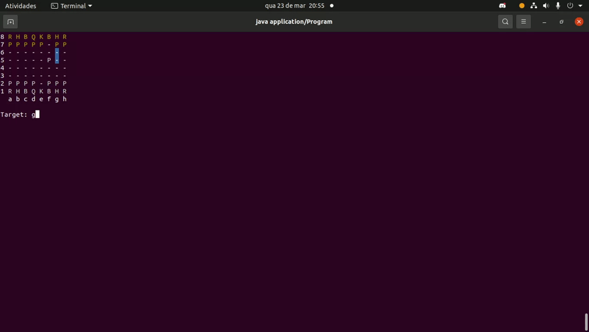

# **Jogo de xadrez**

<p align="center">Jogo de xadrez feito em Java afim de aprofundar mais ainda nos estudos e prática com programação</p>

<p align="center">
 <a href="#pré-requisitos">Pré-requisitos</a> •
 <a href="#jogabilidade">Jogabilidade</a> • 
 <a href="#tecnologias-utilizadas">Tecnologias utilizadas</a> • 
 <a href="#autor">Autor</a>
</p>

## **Pré-requisitos e como rodar a aplicação em testes**
---

Antes de começar, você vai precisar ter instalado em sua máquina as seguintes ferramentas.

- [Git](https://github.com/)
- [Java](https://www.java.com/pt-BR/)
- [Spring Boot Tools](https://spring.io/tools) (caso queira rodar com Spring Boot)

```bash

# Clone este repositorio
$ git clone https://github.com/IagoGondim/Jogo-de-xadrez

# Abra o prompt (windows) ou shell (linux) através da pasta chess-system
$ java -jar chess-system.jar

# Pronto, Divirta-se!!

```

## **Jogabilidade**

### Movimento inicial do jogo de xadrez, mostrando o ponto de origem (origem) e o destino final (target)
---


### Movimento piecePromotion, peão chega no final do tabuleiro e pode escolher qualquer peça, sendo escolhido a Queen
---


### Xeque-mate
---




## **Tecnologias utilizadas**
---
### As seguintes tecnologias utilizadas na construção da API:


- [Java] (https://www.java.com/pt-BR/)
- [Spring Boot] (https://spring.io/)

<h4 align="center"> 
	🚧  🚀 Em construção...  🚧
</h4>

### **Autor**
---

<a href="https://blog.rocketseat.com.br/author/thiago/">
 
 <br />
 <sub><b>Iago Gondim</b></sub></a> 

Entre em contato!

[](https://wa.me/5588999801863?text=Ol%C3%A1%2C%20Mande-me%20uma%20mensagem%2C%20responderei%20assim%20que%20poss%C3%ADvel%20%3A)

[](https://www.linkedin.com/in/iago-gondim-2b163210b/) 
[](mailto:iagogondim200@gmail.com)